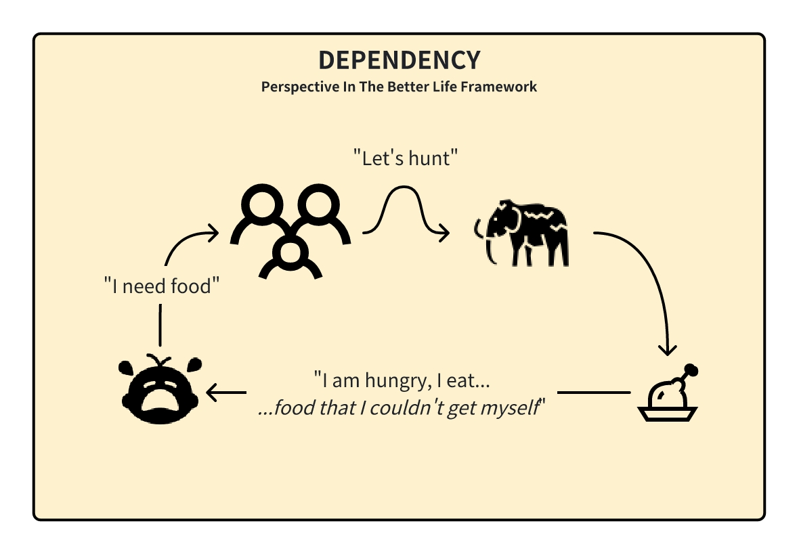
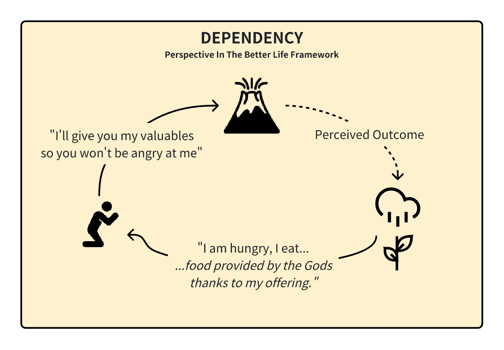

<InfoBanner shouldCenter emoji=":bulb:">
  Whether you're exploring this perspective to understand yourself better or to empathize with someone else's viewpoint, this guide is here to help. Remember, this perspective is just one way of looking at the world, and it's normal for us or others to experience it at different times in our lives. Think of this as a window into how we or they might be thinking and feeling.
</InfoBanner>

## Introduction

In the 'Dependency' perspective, we become acutely aware that others around us – people, animals, and even nature – have their senses, desires, and feelings, much like our own. We start to perceive and respond to these feelings, sometimes even mistaking them as our own. 

We believe that life is about influencing others, from the people in our lives to larger entities like nature or the divine, in order to receive what we need in return to survive.

## How This Perspective Develops

When we are in the ['Survival' perspective](/unlock-your-potential/programs/guide-1), we are only able to survive in environments where we can be self-sufficient. As we encounter more adverse conditions, we realize that we need others in other to survive. 

We start to recognize that other beings have feelings and needs similar to ours. We begin to see the world as an interdependent web of relationships, where our actions can affect others and their reactions can affect us. It's a shift from focusing solely on ourselves for survival to understanding how we can thrive with a larger community or ecosystem.

## Historical Context

The foundations of the 'Dependency' perspective can be traced back to the tribal order established around 50,000 years ago. During this era, the focus was primarily on keeping the group safe and happy. The goal was to ensure safety and security, maintaining functional habits and dependable practices that benefitted the group. 

We would also engage in rituals to petition the gods for favors, as we perceived them as other entities that we had to please in order to survive. A vivid example is found in the rituals of the Incas, who historically offered valuable sacrifices to their gods in hopes of ensuring safety and stability for their community.

Similar practices were observed in other ancient civilizations, where offerings, sometimes even including valuables, were made to appease gods or natural forces, such as volcanoes.

## Modern Context

In the modern day, we tap into the 'Dependency' perspective whenever we rely on others to provide for our basic needs. We will do whatever it takes to get what we need from others.

This manifests most in our infancy, where we respond and react to our caretakers to stimulate them to take care of us. This can manifest in behaviors like crying or acting cute, so those interacting with us are motivated to feed, bathe, and house us.

Welfare programs are set up to support those who find it difficult to take care of themselves due to their circumstances. When we are dependent on these programs, we will act in a way to ensure we continue getting such benefits.

## Strengths and Challenges

A major strength of this perspective lies in our ability to navigate others' emotions to meet our needs. We're particularly effective when these emotions are familiar to us, allowing us to empathize and act accordingly.

However, challenges arise when we encounter emotions or reactions different from our own. Misunderstandings can occur, leading to unmet needs or misaligned actions. The key challenge is in accurately interpreting and responding to the varied emotional landscapes of those around us.

## Unlock Your Potential

To be your best self in this perspective means learning how to communicate with others to get what we need. You won't always be dealing with people who exhibit emotions the way you do, and thus the solutions that work to satisfy you may not work for them.

In such situations, knowing how to communicate properly to get what you need from the situations you find yourself in - even if you don't understand their feelings fully yet.

<ButtonLink to="/unlock-your-potential/programs?filters=LEVEL_2">Check Out Programs For 2: Dependency</ButtonLink>

## Is It Time To Level Up?

If you have satisfied all your basic needs and now are wondering what's more to life than just surviving, you're ready to go to the ['Winning' perspective](/unlock-your-potential/programs/guide-3). 

You might also find that while your caretakers might be willing to support your basic needs, they have their wants that may not align with yours. If that's how you feel, explore the ['Winning' perspective](/unlock-your-potential/programs/guide-3) to learn how to pursue your wants.