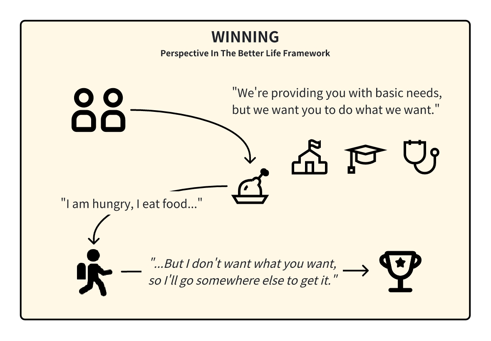

<InfoBanner shouldCenter emoji=":bulb:">
  Whether you're exploring this perspective to understand yourself better or to empathize with someone else's viewpoint, this guide is here to help. Remember, this perspective is just one way of looking at the world, and it's normal for us or others to experience it at different times in our lives. Think of this as a window into how we or they might be thinking and feeling.
</InfoBanner>

## Introduction

Imagine a world where everyone is playing their own game, trying to win in their own way. That's kind of what life feels like from the 'Winning' perspective. It's like being in a big, exciting game where the goal is to look out for ourselves and make the best moves to win. We believe that we need to be our own heroes, and even when others help us, we see it as a win for us.

## How This Perspective Develops

We start feeling this way when our basic needs – like food and a safe place to live – are taken care of. Then we begin to think about what more we want from life. We start to see that we've got to be there for ourselves because sometimes, even the people who care about us might not understand what we really want. Life becomes like a game of give and take, where we do things for others and expect something back.

## Historical Context

The 'Winning' perspective can be linked back to mythic, feudal, and exploitative empires that emerged around 10,000 years ago. This era was characterized by a social structure where the pursuit of personal ambitions and desires was paramount. The primary focus was on doing what one wants, taking what one desires, and getting one's way by any means necessary. It was an age where climbing the ranks of power was the mentality of many.

The goal during this time was to obtain power and glory, often to the extent of being worshiped as a hero. Strategies to achieve this varied: aligning oneself with the powers that be when necessary and taking what was wanted by brute force when possible. This period exemplifies the 'Winning' perspective, where individuals sought to exert their will and influence over others to achieve their objectives. It showcases the historical roots of our desire for winning and power, and how this perspective has been a driving force in shaping societies and cultures throughout human history.

## Strengths and Challenges

We're really good at spotting chances to get ahead, especially when the rewards are clear. We shine in situations where we know exactly what we'll gain.

But, this way of seeing the world has its tough sides too. Sometimes, we might feel let down when we don't get back what we hoped for. And we often have to figure out how to fit in with people who don't think the same way about give and take.

## Unlock Your Potential

We can live better lives when we think of life like a game. We can try to collect points and build up our skills. Focus on internal reward metrics versus external ones, because its easier to feel accomplished when the scoreboard is your own.

Establish what game you're playing so that you can be clear about what you want from each situation, and don't waste time on things that won't help you. 

## Is It Time To Level Up?

If you're getting what you want, that's awesome! You might start wondering, though, if there's more to life. Maybe you're looking for more meaning, or you find that being part of a group makes life better. If that's how you feel, exploring the ['Belonging' perspective](/unlock-your-potential/programs/guide-4) might be your next step.

If things aren't going your way, don't worry. Sometimes, trying to do everything alone doesn't work out. In these times, finding like-minded people can be the key to success. The ['Belong' perspective](/unlock-your-potential/programs/guide-4) can also help here.