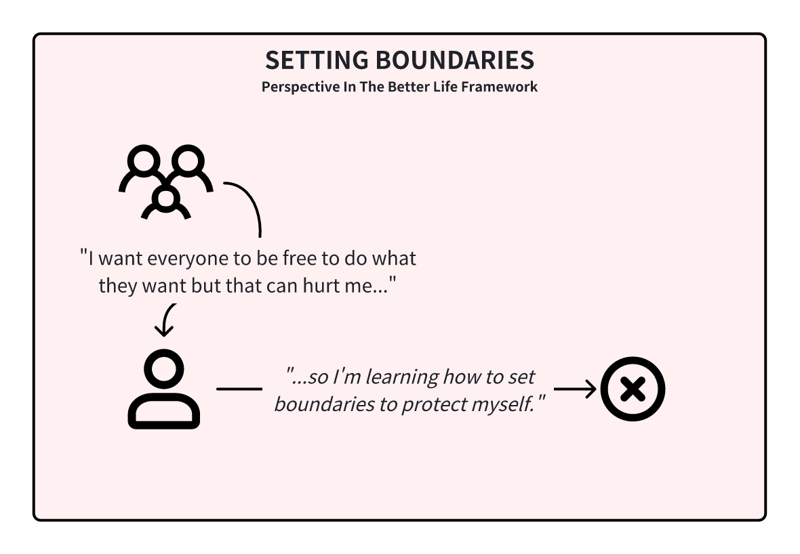

<InfoBanner shouldCenter emoji=":bulb:">
  Whether you're exploring this perspective to understand yourself better or to empathize with someone else's viewpoint, this guide is here to help. Remember, this perspective is just one way of looking at the world, and it's normal for us or others to experience it at different times in our lives. Think of this as a window into how we or they might be thinking and feeling.
</InfoBanner>

## Introduction

Embracing the 'Setting Boundaries' perspective means we value the unique tapestry of who we are while navigating the complexities of human interactions. We champion the freedom of individual expression but also acknowledge the necessity of structure for personal well-being. As we change and grow, so do our boundaries, reflecting our evolving needs and beliefs. Setting boundaries is an act of self-respect and wisdom, ensuring that our interactions are beneficial and that we occasionally say 'no' as an affirmation of our values.

## How This Perspective Develops

We cultivate this perspective as we mature in our understanding that respect for individual freedom includes protecting our own space and peace. We learn to discern our limits, from our basic dislikes to our absolute deal-breakers, and communicate them effectively.

## Historical Context

The 'Setting Boundaries' perspective gained prominence in the world-centered social web of the mid-1900s, a period focused on authentic self-expression and the harmonization of internal and external worlds. This era encouraged us to develop our innate potential while acknowledging the collective needs, yet it also confronted us with the challenges of realizing our full selves, navigating existential dilemmas, and the dangers of superficial conformity.

## Strengths and Challenges

Our primary strength lies in our ability to identify and honor our personal boundaries while understanding others' individualistic tendancies. This builds self-respect and earns the respect of others.

Conversely, our challenge is managing relationships where our boundaries are tested or not recognized, leading to potential conflicts and the need to uphold our principles firmly without alienating those important to us.

## Unlock Your Potential

We unlock our potential when we learn to set and respect boundaries that foster our well-being and growth. It's about understanding ourselves to the fullest and encouraging others to do the same, finding a harmony that benefits ourselves and the broader community.

## Is It Time To Level Up?

If you find yourself frustrated by those who struggle to respect your boundaries, especially those close to you, consider exploring the ['Curiosity' perspective](/unlock-your-potential/programs/guide-8). This shift can provide the patience and understanding needed to navigate complex personal dynamics.

If you're not ready to understand their perspective, consider going to the ['Letting Go' perspective](/unlock-your-potential/programs/guide-6), instead.