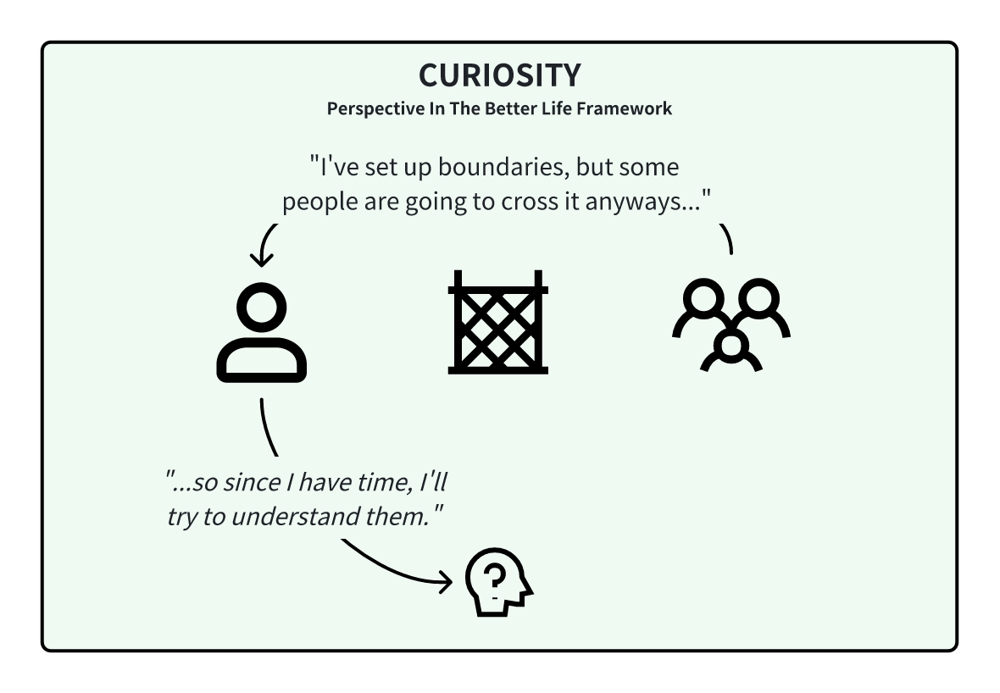

<InfoBanner shouldCenter emoji=":bulb:">
  Whether you're exploring this perspective to understand yourself better or to empathize with someone else's viewpoint, this guide is here to help. Remember, this perspective is just one way of looking at the world, and it's normal for us or others to experience it at different times in our lives. Think of this as a window into how we or they might be thinking and feeling.
</InfoBanner>

## Introduction

The 'Curiosity' perspective recognizes the world as an intricate, ever-evolving place that's beyond any one person's control. Life is not just a game with clear rules; it's a complex show where we are both the audience and the performers. We can't predict everything, but we can learn, experiment, and adapt. In this perspective, we value safe spaces where we can try new things, share our insights, and apply what works best in our journey of continuous learning.

## How This Perspective Develops

As we embrace curiosity, we understand that our rules and beliefs are not one-size-fits-all. What works for one may not work for another, and that's okay. This perspective develops from the recognition that life is an experiment filled with trials, errors, and discoveries. We all seek what's best for us, not through imposition but through understanding and mutual respect. We open our minds to try to understand the others' perspective instead of just bluntly shutting them out.

## Historical Context

Emerging in the late 1900s, the 'Curiosity' perspective reflects a time of collective individualism, where the focus shifted to drawing understanding from a multitude of viewpoints. The mentality was trans-rational, embracing experiences without the immediate need to respond or judge. The goal was to find peace in a world full of unanswered questions, and methods included observing, allowing, and protecting personal boundaries, while acknowledging our interconnectedness.

## Strengths and Challenges

Our strength is our openness to life's vast experiences and our ability to engage with them without preconceived notions. We value inclusiveness and the power of listening to all voices, and opening up our eyes to different interpretations of the world.

The challenges we might face include dealing with spiritual or existential uncertainty, sometimes feeling ungrounded as we seek to understand an infinite array of perspectives without always finding clear answers.

## Unlock Your Potential

To unlock our potential in this perspective, we encourage a sense of wonder and an eagerness to learn. It's about fostering a mindset that is always ready to explore, question, and grow, even when we think we know the answers.

Learn how to ask good questions that will create a safe space for others to share, so that they will tell you about their true feelings and perspectives. Ask questions that are not pointed, but rather exploratory for the other party to discover the answers on their own.

## Is It Time To Level Up?

At the beginning, you'll be asking questions out of curiosity, to figure out why others seem to be so keen on doing things differently than you. As you continue questioning, you may discover that you love the way that others are approaching life, even if you don't see yourself living that way. If you achieve this realization, you are ready for the ['Empathy' perspective](/unlock-your-potential/programs/guide-9).

If you find that you're not able to ask the right questions, but still need to protect yourself, switch to the ['Setting Boundaries' perspective](/unlock-your-potential/programs/guide-8) for self-preservation.