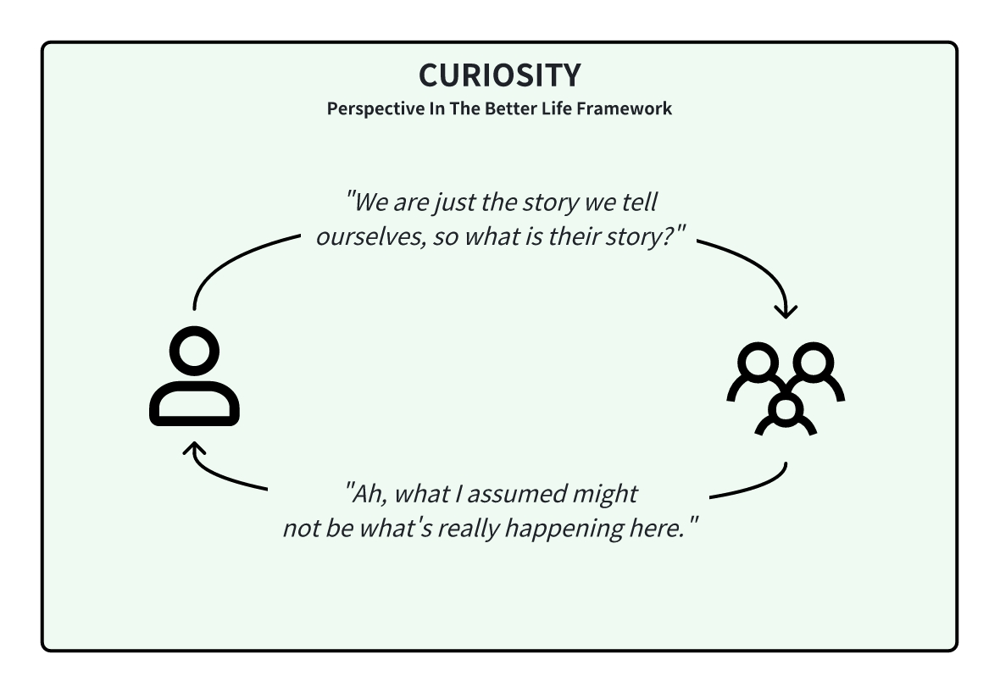

<InfoBanner shouldCenter emoji=":bulb:">
  Whether you're exploring this perspective to understand yourself better or to empathize with someone else's viewpoint, this guide is here to help. Remember, this perspective is just one way of looking at the world, and it's normal for us or others to experience it at different times in our lives. Think of this as a window into how we or they might be thinking and feeling.
</InfoBanner>

## Introduction

In the 'Curiosity' perspective, we recognize the world as an intricate, ever-evolving place that's beyond any one person's control. Life is not just a game with clear rules; it's a complex show where we are both the audience and the performers. We can't predict everything, but we can learn, experiment, and adapt.

In this perspective, we value creating safe spaces where we can try new things, share our insights, and apply what works best in our journey of continuous learning.

## How This Perspective Develops

When we are in the ['Setting Boundaries' perspective](/unlock-your-potential/programs/guide-7), we believe that if everyone understood themselves and set appropriate boundaries, we would have harmony and balance in the world. However, some people in the world will continuously refuse to accept our boundaries, even when the consequences are laid out for them.

We start off feeling frustrated, and lamenting that if only they were able to follow the rules, life would be better for everyone. There would be no crime, and the world would be a better place. When we're busy and have things to do, we don't have time to deal with bad actors and just say NO to them and move on, choosing to associate with people who will respect our boundaries instead.

Eventually, with ample time, we realize that we all seek what's best for us - and we start to think that maybe, we could open our minds to try to understand others' perspectives instead of just bluntly shutting them out and maybe we could learn something new.

## Historical Context

Emerging in the late 1900s, the 'Curiosity' perspective reflects a time of collective individualism, where the focus shifted to drawing understanding from a multitude of viewpoints. The mentality was trans-rational, embracing experiences without the immediate need to respond or judge. The goal was to find peace in a world full of unanswered questions, and methods included observing, allowing, and protecting personal boundaries while acknowledging our interconnectedness.

## Modern Context

In the modern day, the 'Curiosity' perspective manifests when we go into a pursuit of intellectual curiosity when we don't fuss too much about our ego and how we're being spoken to as long as we can learn something new.

## Strengths and Challenges

Our strength is our openness to life's vast experiences and our ability to engage with them without preconceived notions. We value inclusiveness and the power of listening to all voices and opening up our eyes to different interpretations of the world. We will find it easier to apply the 'Curiosity' perspective to situations where we don't feel as emotionally triggered, but we will find true peace when we can apply it to our own situations as well.

The challenges we might face include dealing with spiritual or existential uncertainty, sometimes feeling ungrounded as we seek to understand an infinite array of perspectives without always finding clear answers. Every time we ask questions, we learn something new - and we need to learn how to balance the boundaries we want to set from our perspectives while recognizing the validness of another's perspective (and reality).

## Unlock Your Potential

To be your best self in this perspective, we encourage a sense of wonder and an eagerness to learn. It's about fostering a mindset that is always ready to explore, question, and grow, even when we think we know the answers.

Learn how to ask good questions that will create a safe space for others to share, so that they will tell you about their true feelings and perspectives. Ask questions that are not pointed, but rather exploratory for the other party to discover the answers on their own. 

In general, avoid WHY questions - most people haven't understood themselves deeply enough to know why they do things. Ask WHAT or HOW questions instead, because it is easier to describe motivations and actions, which will then lead the conversation to the why.

<ButtonLink to="/unlock-your-potential/programs?filters=LEVEL_8">Check Out Programs For 8: Curiosity</ButtonLink>

## Is It Time To Level Up?

At the beginning, you'll be asking questions out of curiosity, to figure out why others seem to be so keen on doing things differently than you. As you continue questioning, you may discover that you love the way that others are approaching life, even if you don't see yourself living that way. If you achieve this realization, you are ready for the ['Empathy' perspective](/unlock-your-potential/programs/guide-9).

If you find that you're not able to ask the right questions, but still need to protect yourself, switch to the ['Setting Boundaries' perspective](/unlock-your-potential/programs/guide-7) for self-preservation.